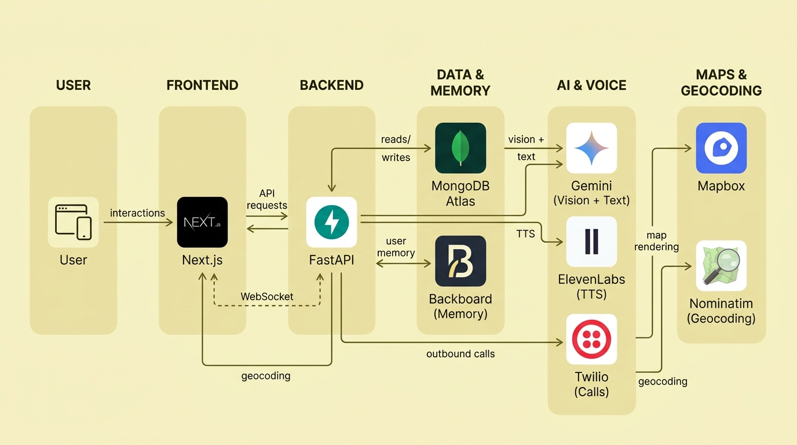

# FridgeBridge

**Connecting people to food banks without cold calls.**

FridgeBridge is a social-good web application built for HackDavis 2026 that helps people turn what they already have in their fridge into a realistic food plan, then connects them to nearby food pantries for the ingredients they are missing. Instead of forcing users to search pantry websites, guess hours, make uncomfortable phone calls, or risk traveling to a pantry that is closed or out of stock, FridgeBridge uses AI vision, pantry discovery, voice agents, live call transcripts, and optimized routing to create a confirmed pickup plan.

The goal is simple: **reduce food insecurity friction, reduce wasted trips, and help households stretch the food they already have.**

---

## Table of Contents

* [Problem](#problem)
* [Solution](#solution)
* [Core Features](#core-features)
* [How It Works](#how-it-works)
* [Technical Architecture](#technical-architecture)
* [Tech Stack](#tech-stack)
* [AI and Agent Design](#ai-and-agent-design)
* [Pantry Ranking Logic](#pantry-ranking-logic)
* [Data Model](#data-model)
* [API Design](#api-design)
* [Real-Time Call Updates](#real-time-call-updates)
* [Privacy, Safety, and Responsible AI](#privacy-safety-and-responsible-ai)
* [Local Development](#local-development)
* [Environment Variables](#environment-variables)
* [Example User Flow](#example-user-flow)
* [Impact](#impact)
* [Roadmap](#roadmap)
* [Team](#team)

---

## Problem

Food insecurity is not only a supply problem. It is also an access, information, and coordination problem.

Many people technically have help nearby, but they still face several barriers:

* Food pantry hours are often outdated, inconsistent, or hard to verify.
* Pantry websites may not list current inventory.
* Calling multiple locations is time-consuming and emotionally uncomfortable.
* A person may travel across town only to find that the pantry is closed, the needed ingredients are unavailable, or eligibility requirements are unclear.
* Households may already have useful ingredients at home but lack a clear plan for how to combine them into meals.
* Near-expiry groceries often go unused because users do not know what to cook before they spoil.

FridgeBridge addresses the gap between **food at home**, **food assistance nearby**, and **the real-time information needed to confidently access it**.

---

## Solution

FridgeBridge makes the call for you.

A user takes a photo of their fridge, and the app identifies available ingredients, detects items that may expire soon, recommends recipes, determines what is missing, finds nearby food pantries, and sends AI voice agents to call several pantries in parallel. The app then streams live call results back to the dashboard and generates an optimized pickup route.

Instead of asking the user to figure out every step alone, FridgeBridge turns a vague question — “What can I eat, and where can I get what I’m missing?” — into an actionable plan.

---

## Core Features

### Fridge Vision

Users upload or capture a fridge photo. Gemini Flash analyzes the image and extracts likely ingredients, quantities, categories, and possible expiration risk.

Example output:

```json
{
  "items": [
    {
      "name": "eggs",
      "category": "protein",
      "estimated_quantity": "6 count",
      "expiration_risk": "low"
    },
    {
      "name": "spinach",
      "category": "vegetable",
      "estimated_quantity": "half bag",
      "expiration_risk": "high"
    }
  ]
}
```

### Smart Recipe Suggestions

The recipe engine prioritizes meals that use ingredients the user already has, especially items that appear close to expiration. This helps households stretch existing groceries and reduce waste.

### Missing Ingredient Detection

For each suggested recipe, FridgeBridge identifies missing ingredients and groups them by importance:

* Required ingredients
* Optional substitutions
* Pantry-friendly staples
* Dietary or allergen-sensitive alternatives

### Pantry Locator Agent

The app searches nearby food pantries using location data, then ranks them based on distance, hours, pantry metadata, and historical availability stored in the database.

### AI Voice Swarm

FridgeBridge can call multiple pantries simultaneously. Each AI voice agent asks whether the pantry is open, whether specific ingredients or categories are available, and whether there are any eligibility or pickup instructions.

### Live Results Dashboard

As calls happen, transcripts and structured results are streamed to the frontend in real time. Users can see which pantries answered, what they said, and which locations are worth visiting.

### Optimized Pickup Route

Confirmed pantry results are passed into Mapbox routing so the user can see the most efficient pickup path and open it in Apple Maps or Google Maps.

---

## How It Works

FridgeBridge runs in three main phases.

### Phase 1: Fridge Vision + Smart Recipes

1. User uploads a fridge photo.
2. Gemini Flash detects visible ingredients.
3. The user can edit or confirm the ingredient list.
4. The backend stores fridge history and user staples.
5. The recipe engine generates meal options from available ingredients.
6. The system identifies what ingredients are missing.

### Phase 2: Pantry Locator Agent

1. The user provides a search radius or location.
2. Google Places finds nearby food pantries, food banks, community fridges, and related support locations.
3. MongoDB geospatial queries filter and rank candidate pantries.
4. Gemini helps interpret pantry metadata and match likely pantry categories against the user’s missing ingredients.
5. The top candidates are selected for verification.

### Phase 3: Voice Swarm + Live Results

1. The backend creates a call task for each selected pantry.
2. Twilio initiates outbound PSTN calls.
3. ElevenLabs powers the conversational voice agent.
4. The agent asks about availability, hours, eligibility, and pickup instructions.
5. Call transcripts are processed into structured pantry results.
6. FastAPI streams live updates to the frontend using Server-Sent Events.
7. Mapbox generates a pickup route using confirmed pantry locations.

---

## Technical Architecture

FridgeBridge is designed as a full-stack, AI-native application with a clear separation between user interface, AI orchestration, external service integrations, real-time updates, and persistence.


### Frontend Layer

The frontend is built with Next.js, React, TypeScript, Tailwind CSS, and shadcn/ui. It handles:

* Fridge image upload
* Ingredient review and editing
* Recipe display
* Pantry result visualization
* Live call transcript rendering
* Interactive Mapbox route display
* One-tap navigation handoff

### Backend Layer

The backend is a FastAPI service responsible for AI orchestration and external API coordination. It handles:

* Image analysis requests
* Recipe generation
* Pantry search and ranking
* Async call dispatch
* Twilio webhook handling
* ElevenLabs voice-agent session coordination
* SSE event streaming
* MongoDB persistence

### Persistence Layer

MongoDB Atlas stores user sessions, fridge items, pantry metadata, call results, and route plans. Geospatial indexes allow fast pantry filtering by distance, while change streams support near real-time updates when call results are inserted or modified.

### Memory Layer

Backboard stores lightweight user memory such as dietary preferences, common staples, previously scanned fridge items, and recurring pantry preferences. This allows the app to improve suggestions over time without forcing the user to re-enter the same context.

---

## Tech Stack

| Layer             | Technology                        | Purpose                                                         |
| ----------------- | --------------------------------- | --------------------------------------------------------------- |
| Frontend          | Next.js 16                        | App router, server components, frontend routing                 |
| UI                | React 19, Tailwind CSS, shadcn/ui | Responsive user interface and reusable components               |
| Language          | TypeScript                        | Type safety across frontend logic                               |
| Backend           | FastAPI                           | Python AI microservice and API layer                            |
| Async Runtime     | Python `asyncio`                  | Parallel pantry calling and concurrent API requests             |
| AI Vision + Text  | Gemini 2.5 Flash                  | Fridge image understanding, recipe generation, pantry reasoning |
| Voice AI          | ElevenLabs                        | Conversational pantry-calling agent                             |
| Telephony         | Twilio                            | Outbound phone calls, TwiML, call webhooks                      |
| Database          | MongoDB Atlas                     | Pantry data, call logs, fridge history, geospatial queries      |
| Real-Time Updates | Server-Sent Events                | Live call transcripts and pantry result updates                 |
| Memory            | Backboard                         | User staples, dietary context, fridge history                   |
| Places Search     | Google Places API                 | Nearby pantry and food-bank discovery                           |
| Routing           | Mapbox                            | Interactive maps and optimized pickup routes                    |

---

## AI and Agent Design

FridgeBridge uses AI in multiple places, but each model has a bounded responsibility.

### Vision Agent

The vision agent receives the fridge image and returns structured ingredient data. The model is prompted to avoid overclaiming and mark uncertain items with a confidence score.

Expected fields:

* Ingredient name
* Category
* Estimated quantity
* Confidence score
* Expiration risk
* Suggested substitutions

### Recipe Agent

The recipe agent receives confirmed ingredients, dietary preferences, and missing ingredients. It returns recipes that maximize use of existing food.

Ranking priorities:

1. Uses near-expiry ingredients first
2. Requires the fewest missing ingredients
3. Supports substitutions
4. Respects dietary preferences
5. Keeps recipes realistic and low-cost

### Pantry Locator Agent

The locator agent reasons over nearby pantry candidates and missing ingredients. It helps select which pantries are worth calling first.

Factors considered:

* Distance from user
* Pantry category
* Opening hours
* Phone availability
* Historical successful call rate
* Past ingredient availability
* User transportation constraints

### Voice Agent

Each voice agent follows a narrow call script:

1. Introduce itself as an automated assistant helping someone locate food assistance.
2. Ask whether the pantry is currently open or when it will next be open.
3. Ask whether the pantry has the needed ingredient categories.
4. Ask about pickup rules, eligibility requirements, or appointment requirements.
5. Confirm address and useful instructions.
6. Thank the pantry and end the call.

The voice agent does not make false claims, impersonate a human, or request sensitive information from the pantry.

---

## Pantry Ranking Logic

FridgeBridge ranks pantries using a weighted score instead of relying only on distance.

Example scoring model:

```text
pantry_score =
  0.30 * availability_match +
  0.20 * open_now_score +
  0.20 * distance_score +
  0.15 * call_success_score +
  0.10 * route_efficiency_score +
  0.05 * user_preference_score
```

### Score Components

| Component                | Description                                                                                      |
| ------------------------ | ------------------------------------------------------------------------------------------------ |
| `availability_match`     | How closely confirmed pantry inventory matches missing ingredients                               |
| `open_now_score`         | Whether the pantry is currently open or opening soon                                             |
| `distance_score`         | Normalized distance from user location                                                           |
| `call_success_score`     | Historical likelihood that the pantry answers calls                                              |
| `route_efficiency_score` | Whether the pantry fits into an efficient pickup route                                           |
| `user_preference_score`  | User-specific preferences such as walking distance, dietary needs, or previous successful visits |

This ranking design ensures that the “best” pantry is not merely the closest one. It is the pantry most likely to actually help the user today.

---

## Data Model

### User Profile

```ts
type UserProfile = {
  id: string;
  dietaryPreferences: string[];
  allergens: string[];
  householdSize?: number;
  preferredRadiusMiles: number;
  transportationMode: "walking" | "biking" | "driving" | "public_transit";
  staples: string[];
  createdAt: string;
  updatedAt: string;
};
```

### Fridge Item

```ts
type FridgeItem = {
  id: string;
  userId: string;
  name: string;
  category: string;
  estimatedQuantity?: string;
  expirationRisk: "low" | "medium" | "high" | "unknown";
  confidence: number;
  source: "vision" | "manual";
  createdAt: string;
};
```

### Pantry

```ts
type Pantry = {
  id: string;
  name: string;
  phone?: string;
  address: string;
  location: {
    type: "Point";
    coordinates: [number, number];
  };
  hours?: Record<string, string>;
  googlePlaceId?: string;
  lastVerifiedAt?: string;
  historicalAvailability?: string[];
};
```

### Pantry Call Result

```ts
type PantryCallResult = {
  id: string;
  pantryId: string;
  status: "queued" | "calling" | "answered" | "no_answer" | "failed" | "completed";
  transcript: string[];
  structuredResult?: {
    openNow: boolean;
    availableItems: string[];
    unavailableItems: string[];
    eligibilityNotes?: string;
    pickupInstructions?: string;
    confidence: number;
  };
  createdAt: string;
  updatedAt: string;
};
```

---

## API Design

### Analyze Fridge Image

```http
POST /api/fridge/analyze
Content-Type: multipart/form-data
```

Returns detected ingredients and confidence scores.

### Generate Recipes

```http
POST /api/recipes/generate
Content-Type: application/json
```

Request body:

```json
{
  "userId": "user_123",
  "ingredients": ["eggs", "spinach", "milk"],
  "dietaryPreferences": ["vegetarian"]
}
```

### Find Nearby Pantries

```http
POST /api/pantries/search
Content-Type: application/json
```

Request body:

```json
{
  "lat": 38.5449,
  "lng": -121.7405,
  "radiusMiles": 5,
  "missingIngredients": ["rice", "beans", "tomatoes"]
}
```

### Start Pantry Calls

```http
POST /api/calls/start
Content-Type: application/json
```

Starts parallel AI voice calls to selected pantries.

### Subscribe to Live Results

```http
GET /api/calls/{sessionId}/stream
Accept: text/event-stream
```

Streams live status updates, transcript snippets, and structured results.

### Generate Route

```http
POST /api/routes/optimize
Content-Type: application/json
```

Returns an optimized Mapbox route for confirmed pantry stops.

---

## Real-Time Call Updates

FridgeBridge uses Server-Sent Events because the communication pattern is mostly one-way: the backend continuously pushes call progress to the frontend.

Example event payload:

```json
{
  "type": "call_update",
  "pantryId": "pantry_456",
  "status": "answered",
  "transcriptDelta": "Yes, we are open until 4 PM today...",
  "timestamp": "2026-05-10T18:30:00Z"
}
```

SSE keeps the live dashboard lightweight while still allowing users to watch the pantry verification process unfold in real time.

---

## Privacy, Safety, and Responsible AI

FridgeBridge handles sensitive user context, so the system is designed around data minimization, transparency, and user control.

### Privacy Principles

* Fridge images should be deleted after analysis unless the user explicitly chooses to save fridge history.
* User location should only be used for pantry discovery and route planning.
* Dietary preferences and household context should be stored only when needed for personalization.
* Raw call transcripts should be visible to the user and deletable.
* The app should avoid collecting unnecessary personal information from food pantries or users.

### Voice Agent Safety

* The agent clearly identifies itself as an automated assistant.
* The agent does not impersonate the user.
* The agent asks only food-access-related questions.
* The agent does not pressure pantry staff.
* The agent does not make eligibility claims on behalf of the user.
* The agent summarizes uncertainty instead of inventing availability.

### AI Reliability Safeguards

* Ingredient detection includes confidence scores.
* Users can manually edit detected fridge items.
* Pantry inventory is treated as unverified until confirmed by call.
* Live transcripts allow users to inspect what the agent actually heard.
* Structured call results should include confidence and raw transcript references.

---

## Local Development

### Prerequisites

Install the following:

* Node.js 20+
* Python 3.11+
* MongoDB Atlas account or local MongoDB instance
* Twilio account with an outbound phone number
* ElevenLabs account with a configured conversational agent
* Gemini API key
* Google Places API key
* Mapbox access token

### Repository Setup

```bash
git clone https://github.com/your-org/fridgebridge.git
cd fridgebridge
```

### Frontend Setup

```bash
cd frontend
npm install
npm run dev
```

The frontend runs at:

```text
http://localhost:3000
```

### Backend Setup

```bash
cd backend
python -m venv .venv
source .venv/bin/activate
pip install -r requirements.txt
uvicorn app.main:app --reload
```

The backend runs at:

```text
http://localhost:8000
```

---

## Environment Variables

Create a `.env.local` file for the frontend and a `.env` file for the backend.

### Frontend

```env
NEXT_PUBLIC_API_BASE_URL=http://localhost:8000
NEXT_PUBLIC_MAPBOX_TOKEN=your_mapbox_public_token
```

### Backend

```env
GEMINI_API_KEY=your_gemini_api_key
GOOGLE_PLACES_API_KEY=your_google_places_api_key
MAPBOX_ACCESS_TOKEN=your_mapbox_access_token
MONGODB_URI=your_mongodb_connection_string
MONGODB_DB_NAME=fridgebridge
TWILIO_ACCOUNT_SID=your_twilio_account_sid
TWILIO_AUTH_TOKEN=your_twilio_auth_token
TWILIO_PHONE_NUMBER=your_twilio_phone_number
ELEVENLABS_API_KEY=your_elevenlabs_api_key
ELEVENLABS_AGENT_ID=your_elevenlabs_agent_id
BACKBOARD_API_KEY=your_backboard_api_key
BACKEND_PUBLIC_URL=your_public_backend_url_for_webhooks
```

For local Twilio webhook testing, use a tunneling tool such as ngrok:

```bash
ngrok http 8000
```

Then set `BACKEND_PUBLIC_URL` to the generated HTTPS URL.

---

## Example User Flow

1. User opens FridgeBridge and uploads a fridge photo.
2. Gemini detects eggs, spinach, milk, tortillas, and half-used vegetables.
3. The user confirms the ingredient list.
4. FridgeBridge recommends spinach egg wraps and vegetable fried rice.
5. The app identifies rice, beans, and tomatoes as useful missing ingredients.
6. The user chooses a 5-mile pantry search radius.
7. Google Places returns nearby food pantries.
8. MongoDB geospatial ranking selects the strongest candidates.
9. Twilio and ElevenLabs call up to five pantries in parallel.
10. Live transcripts show which pantries answered and what they have available.
11. FridgeBridge confirms two pantry options.
12. Mapbox generates the most efficient route.
13. The user leaves home with confirmed pantry information instead of uncertainty.

---

## Impact

FridgeBridge is designed around three forms of impact.

### 1. Reducing Wasted Trips

A pantry visit should not require guessing. By calling ahead and confirming availability, FridgeBridge helps users avoid unnecessary travel to closed or understocked locations.

### 2. Lowering the Social Barrier to Asking for Help

Food assistance can be emotionally difficult to seek. FridgeBridge reduces the friction of making repeated phone calls while still keeping the user informed and in control.

### 3. Reducing Household Food Waste

By prioritizing recipes around ingredients users already have, especially near-expiry items, FridgeBridge helps households turn existing food into meals before it is wasted.

### Measurable Success Metrics

Potential metrics for evaluating impact:

* Number of pantry calls completed
* Percentage of calls that return usable pantry information
* Number of confirmed pantry trips generated
* Estimated avoided failed trips
* Average distance saved per user
* Number of near-expiry ingredients used in recipe plans
* User-reported meals created from existing ingredients
* Pantry answer-rate and availability trends over time

---

## Roadmap

### Near-Term

* Add user authentication
* Save repeat pantry preferences
* Improve pantry ranking with historical call outcomes
* Add multilingual voice agents
* Add SMS summaries after successful pantry calls
* Add pantry eligibility filters
* Add manual pantry verification by volunteers

### Long-Term

* Partner directly with food banks for real-time inventory feeds
* Add community fridge support
* Add nutrition-aware recipe planning
* Add public transit routing
* Add accessibility-first voice navigation
* Build a pantry dashboard for organizations to update availability
* Support disaster-response food distribution workflows

---

## Why FridgeBridge Matters

FridgeBridge is not just a pantry finder. It is an orchestration layer between the user’s current food situation, nearby community resources, and real-time confirmation.

The technical challenge is meaningful because it combines:

* Computer vision for household inventory
* LLM reasoning for recipes and missing ingredients
* Geospatial search for nearby resources
* Async backend orchestration for parallel calls
* Voice AI for real-world pantry verification
* Real-time streaming for user trust
* Route optimization for practical action

The social impact is meaningful because the app targets a real gap in the food assistance experience: help may exist, but people still need confidence that the help is available, reachable, and worth the trip.

FridgeBridge turns uncertainty into a plan.
